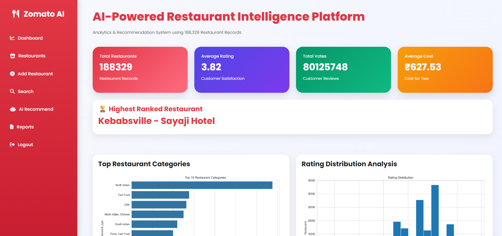
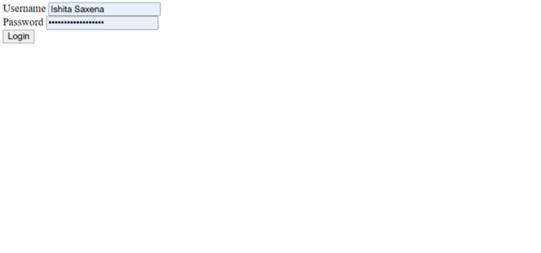
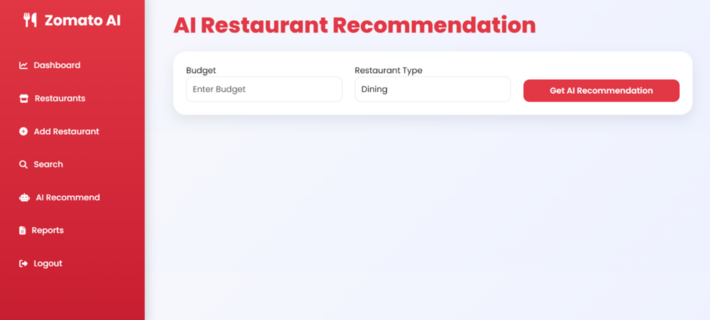
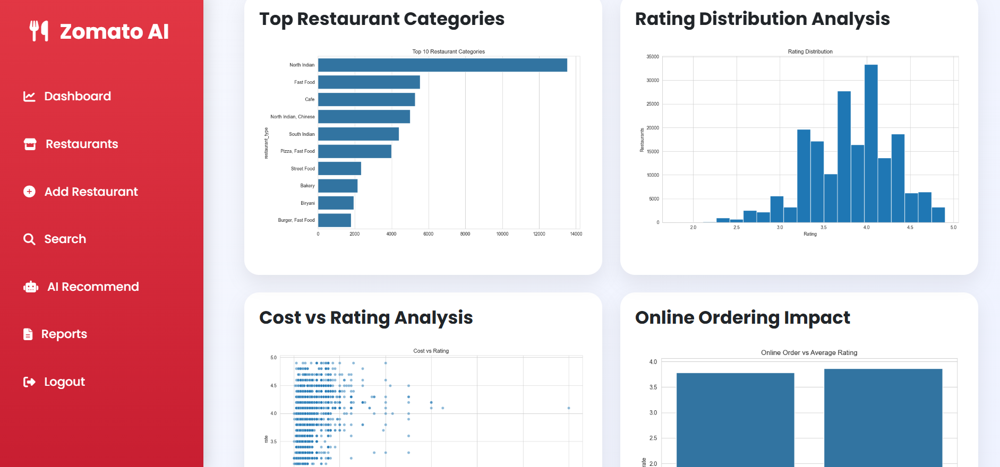
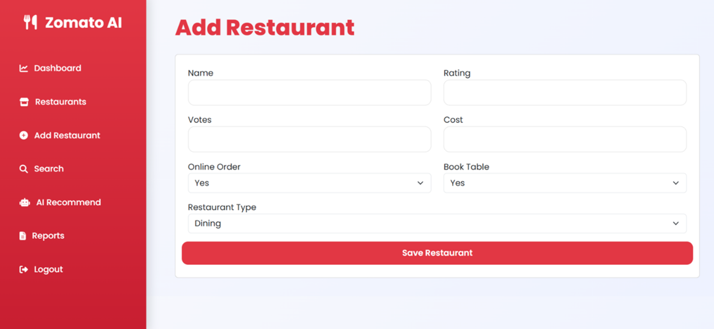
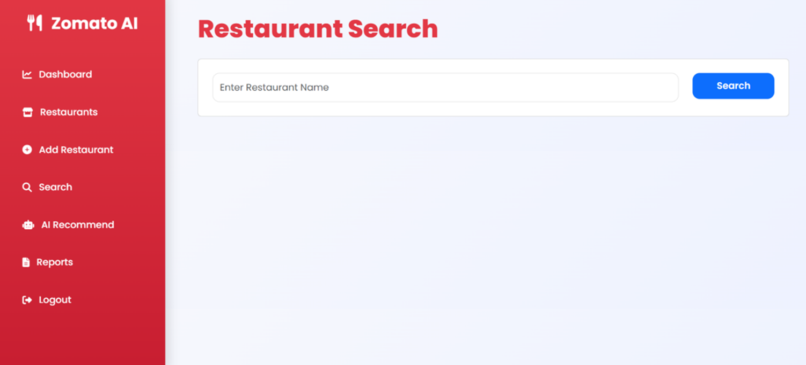
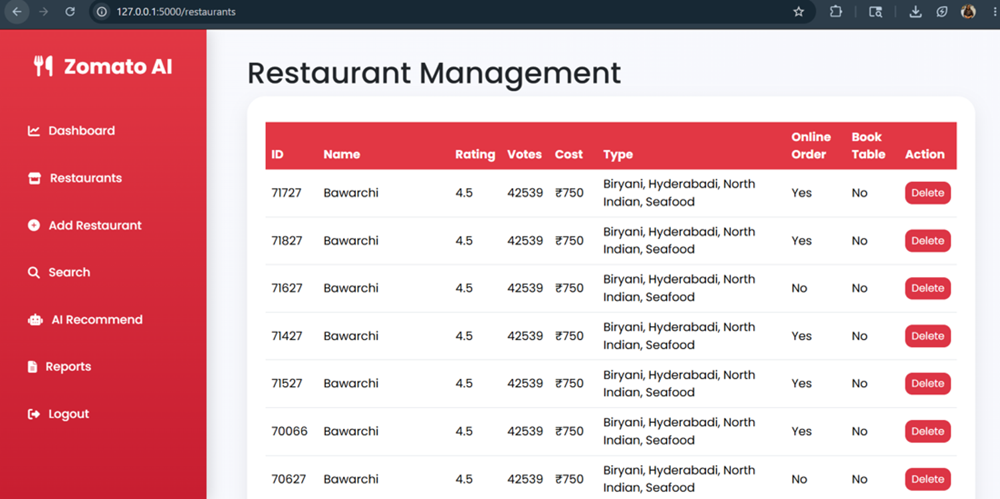

# Zomato Restaurant Analytics Dashboard

## Overview

The Zomato Restaurant Analytics Dashboard is a Business Intelligence and Restaurant Recommendation System developed using Flask, MySQL, Pandas, Matplotlib, Seaborn, HTML, CSS, Bootstrap, and JavaScript.

The project analyzes 188,000+ restaurant records and transforms raw restaurant data into meaningful insights through interactive dashboards, reports, visualizations, and AI-based recommendations.

## Features

* User Authentication
* Restaurant Management
* Restaurant Search
* Dashboard Analytics
* Data Visualization
* AI-Based Recommendation System
* Business Intelligence Reports
* PDF Report Generation

## Technologies Used

* Python
* Flask
* MySQL
* Pandas
* NumPy
* Matplotlib
* Seaborn
* HTML
* CSS
* Bootstrap
* JavaScript

## Dataset

Restaurant dataset containing approximately 188,329 records.

## Screenshots

### Dashboard

### Login Page

### Recommendations

### Reports

### Add Restaurants

### Search

### Restaurants

## Author

Ishita Saxena
B.Tech (Computer Science & Engineering)
Institute of Technology & Management, Gwalior
